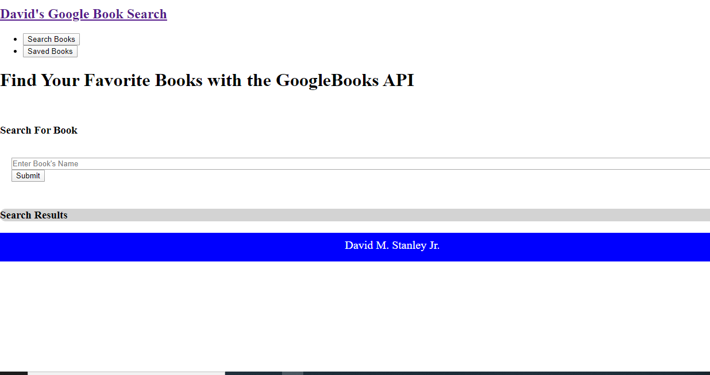
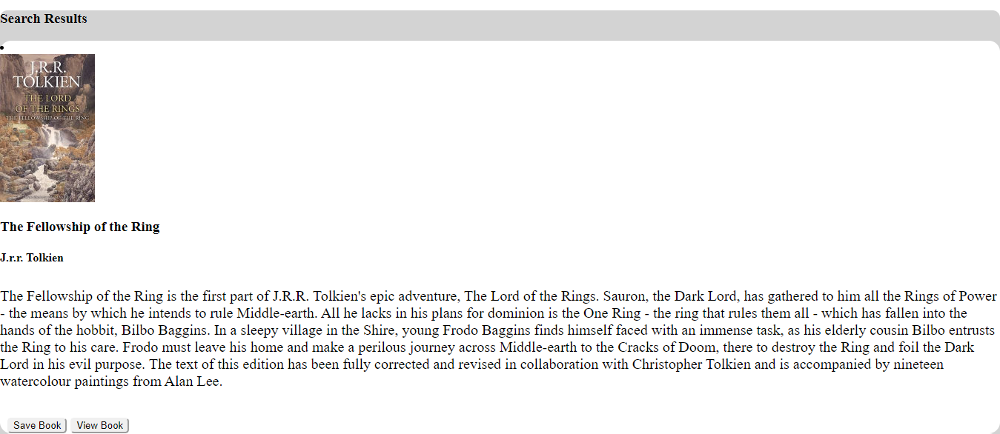
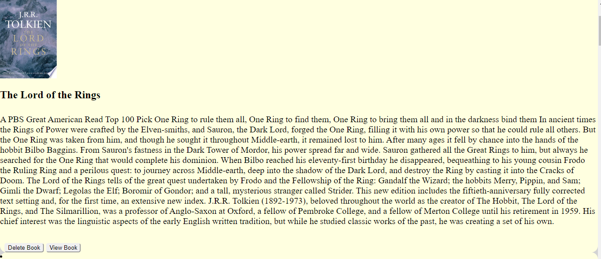

# google-books-search

Welcome to my Google Books Search React App. This app allows you to search for a book, click on the link to Google Books, save the book and delete it. This application stores the saved books into a MongoDB database using Mongoose. CRUD operations allow for the books to also be deleted.

# Environment Setup

1. Clone my repo at https://github.com/davidmstanleyjr/google-books-search.git
2. Install the required NPM packages by typing NPM install into Git Bash.
3. CD into the Google-Books-Search repo.
4. Enter NPM start to load React.

# NPM Packages

This application uses the following NPM packages:

1. Express https://www.npmjs.com/package/express**
2. If-ENV https://www.npmjs.com/package/if-env**
3. Mongoose https://www.npmjs.com/package/mongoose**
4. React https://www.npmjs.com/package/react**
5. React-Router-DOM https://www.npmjs.com/package/react-router-dom**
6. React-Bootstrap https://www.npmjs.com/package/react-bootstrap**
7. React-Scripts https://www.npmjs.com/package/react-scripts**
8. Axios https://www.npmjs.com/package/axios**

# Link to the live web application

**https://davids-google-book-search.herokuapp.com/**

# Screenshots

